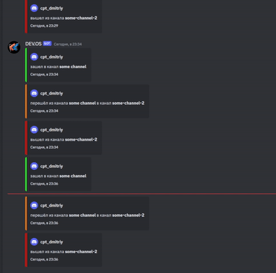

# Discord bot audit log
Бот для логирования перемещения пользователей по голосовым каналам.

## Оглавление
- [О проекте](#about-project)
- [Технологии](#technologies)
- [Запуск](#setup)


## <a id="about-project">О проекте</a>


Данный бот сохраняет информацию о перемещение пользователей в текстовой канал. Бот сохранят логин пользователя, название канала и время перемещения.

##  <a id="technologies">Технололгии</a>

 Бот написан на go версии 1.21.0 с использованием библиотеки discordgo. Для удобства разработки и развёртывания используется docker.

 ## <a id="setup">Запуск</a>
 
Перед запуском необходима указать токен в переменной TOKEN и id текстового канала куда будут отправляться логи в переменной LOG_CHANNEL_ID в [docker-compose.yml](./deployments/docker-compose.yml). Далее перейти в папку deployments. Выполнить сборку и запуск.

 ### Cборка
 ```bash
docker compose build
```

 ###  Запуск
 ```bash
docker compose up
```
